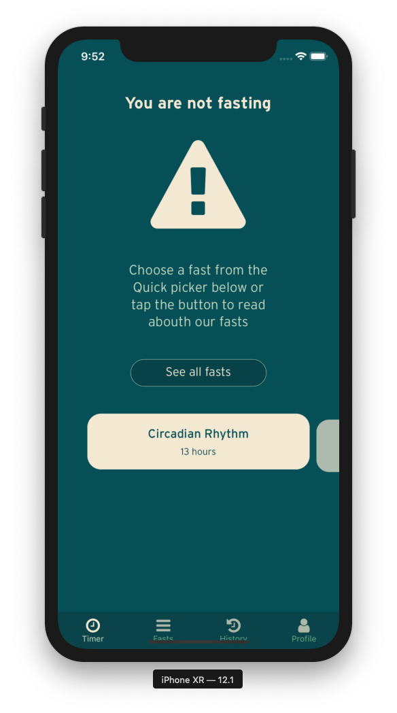
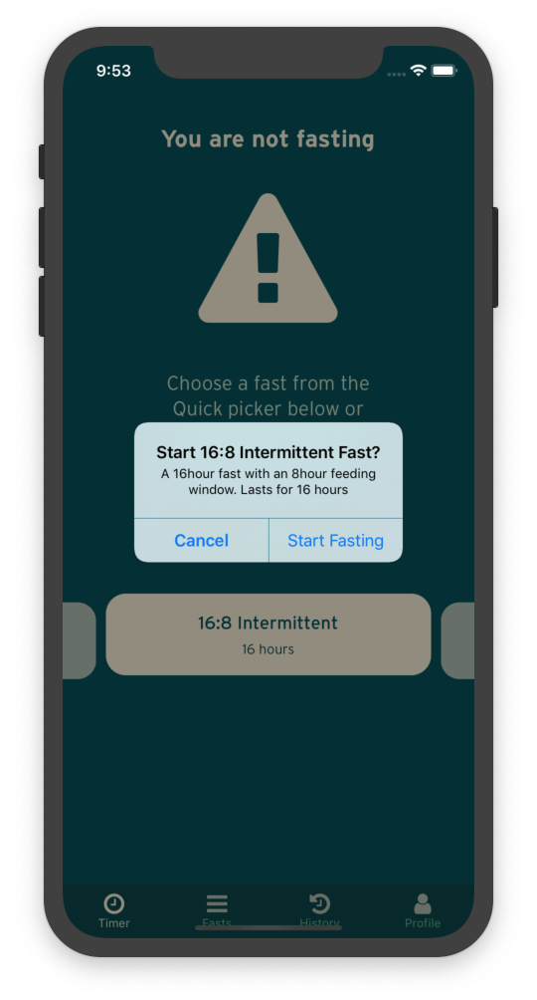
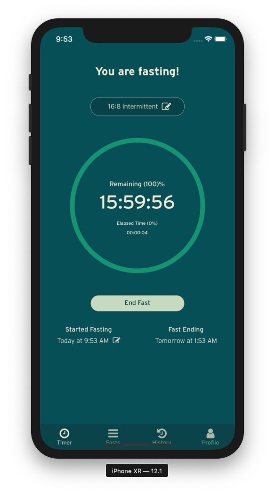
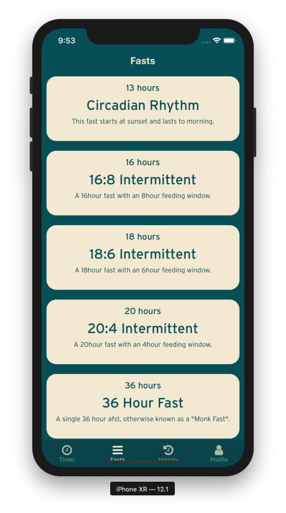
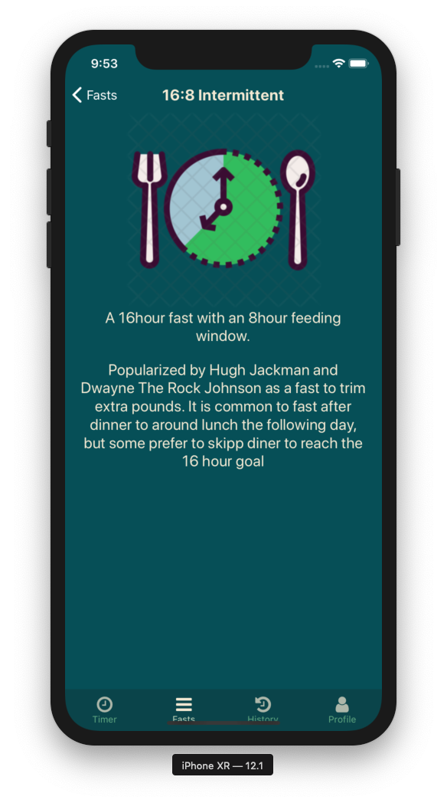
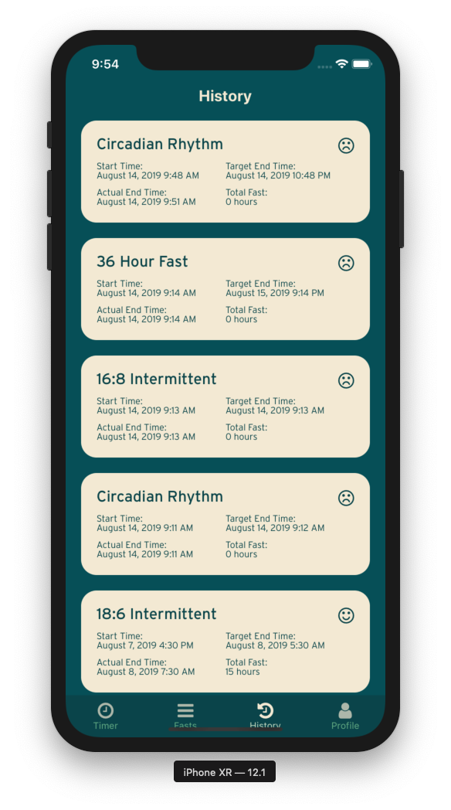

# Description

- A timer that informs users how long their fasting period has lasted
- The ability to set/edit fast start and end time
- The ability to set fast reminder alarms
- History Report
- Tracking graph to show: fast goal, reached goal, didn’t reach goal
- Ability to select a fast: circadian rhythm, 16:8, 18:6, 20:4, 36 hour fast

# What I learned

- React Native
- React Navigation
- Social Auth
- Firebase Auth
- Firebase Cloud Messaging
- Firebase Firestore
- Firebase Firestore Rules
- Local Storage

# Screenshots

